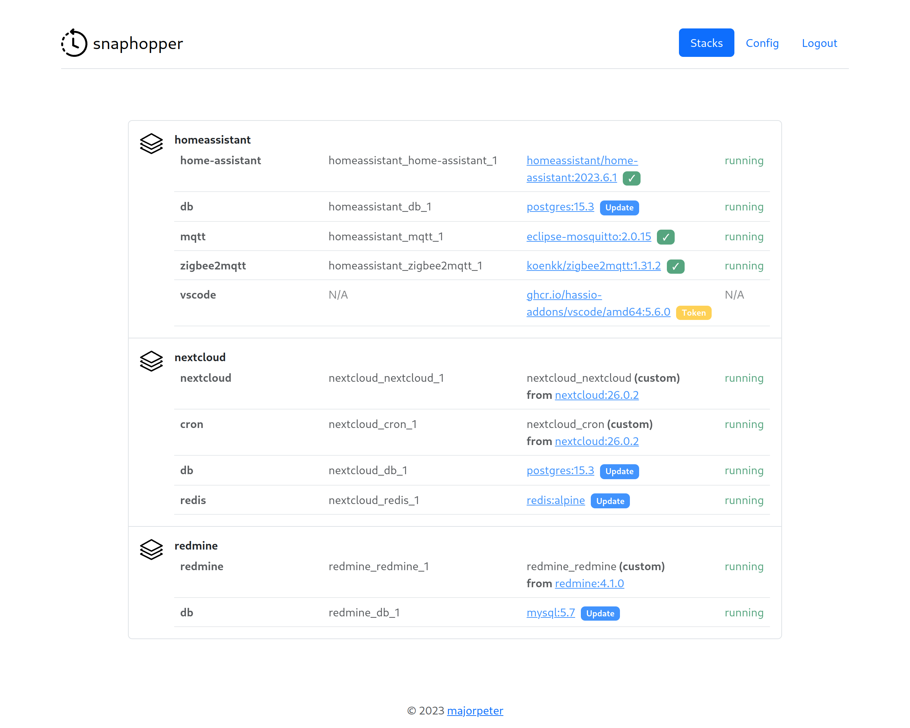
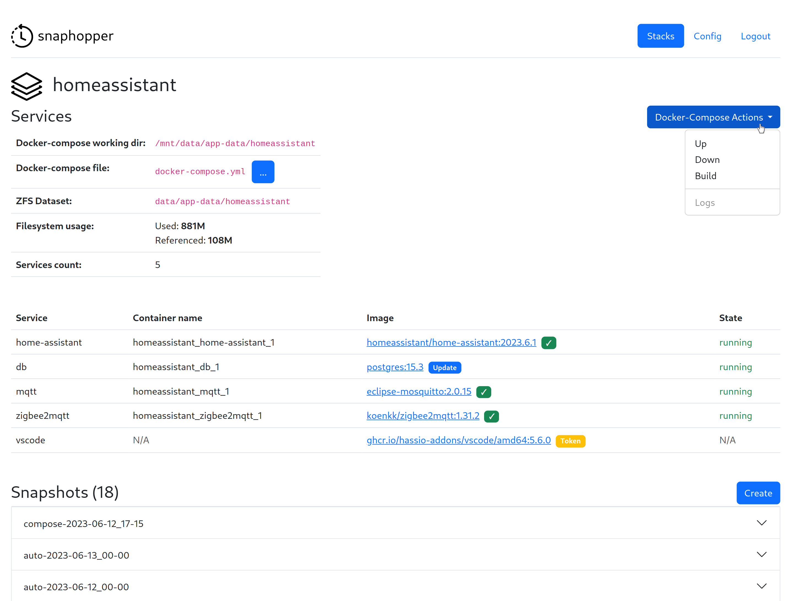

= snaphopper

image::https://github.com/majorpeter/snaphopper/actions/workflows/test.yml/badge.svg[tests,link=https://github.com/majorpeter/snaphopper/actions/workflows/test.yml]

This application provides an intuitive interface to manage self-hosted applications on a remote server using `docker-compose` and `ZFS`.

== Features

* dashboard with container status information, extracted from `docker-compose.yml` files and running containers
* automatic update check for container images
* backup creation & rollback using ZFS that stops and restarts services via `docker-compose`
* `docker-comose.yml` text editor with automatic ZFS snapshot, docker-compose down & up calls
* update feature for custom containers via `git pull` (they can be rebuilt & recreated from the UI as well)

== Installation

Build and run the container:

[.sh]
....
git clone https://github.com/majorpeter/snaphopper.git
cd snaphopper
docker build . -t snaphopper
docker run --name snaphopper -p 8080:8080 snaphopper
....

The application listens on port `8080` and uses the password `admin` by default. Both can be changed on the _Config_ page.

[NOTE]
====
Use the environment variable `CONFIG_DIR` to make configuration persistent between updates/rebuilds.
====

=== nginx reverse proxy configuration

If you're running the application behind a reverse proxy (e.g. for SSL), make sure to add the following under `location /`:

....
proxy_buffering off;
....

This is required for shells to work _interactively_ (docker-compose actions, git pulls), otherwise the proxy will only send the whole command output once it's finished.

== Test environment

The application was developed and tested on a link:https://www.truenas.com/truenas-scale/[TrueNAS Scale] _22.12.2_ host with the following dependencies:

* `Docker version 20.10.18, build b40c2f6`
* `docker-compose version 1.25.0`
* `zfs 2.1.9`

[IMPORTANT]
====
TrueNAS Scale's `K3s`-based _Application_ subsystem is not used and is *not compatible* with `docker-compose`.
====

== Development

=== Backend

The backend can be launched in a development setup that automatically transpiles on code changes:

[.sh]
....
cd backend/
npm run dev
....

[NOTE]
====
This can also be used for debug launch in VSCode.
====

=== Frontend

Once the backend is running and listening on port `8080`, the frontend can also be started for development:

[.sh]
....
cd frontend/
npm run dev
....

If the backend listens on a different port, change the `proxy` setting accordingly in `vite.config.js`.
